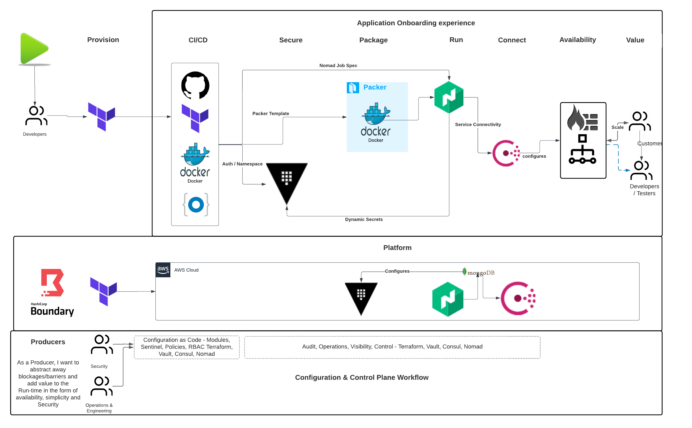

# terraform-com-showcase-pipeline
a demo enviroment that creates a githup repo, a TF Workspace, a Vault namespace and OKTA SSO App all integrated.




the main variable this code needs is *application_name*, with the tfvars bellow, application_name will be a variable passed in at runtime.


terraform.tfvars
```ruby

#Vault
vault_namespace = ""
vault_token = ""
vault_address = ""
#Consul
consul_address = ""
consul_token = ""
#Nomad
nomad_address = ""
#TFC
tfe_username = ""
tfe_organization = ""
tfe_token = ""
tfe_oauth_token_id= "" # for the CVS set up in TFC, you can get it from the settings page under VCS providers
#Github
github_provider_token=""
#Docker
docker_hub_namespace=""
docker_hub_username=""
docker_hub_password=""
#Gitlab
gitlab_token=""
#Okta
okta_org_name=""
okta_base_url_full=""
okta_base_url=""
okta_api_token=""
okta_user_email=""
roles = {
  okta_admin = {
    token_policies = ["admin-policy","superadmin"]
    bound_groups = ["vault-admins-<application_name>"]
  },
  okta_devs  = {
    token_policies = ["devs-policy","superadmin"]
    bound_groups = ["vault-devs-<application_name>"]
  }
}
#Boundary
boundary_address=""
auth_method_id = ""
username       = ""
password       = ""
backend_server_ips = [""]
postgres_hostname = ""
postgres_port = 5432
postgres_name = ""
postgres_username =""
postgres_password =""
sshca_hostname = ""
sshca_public_key = ""

```